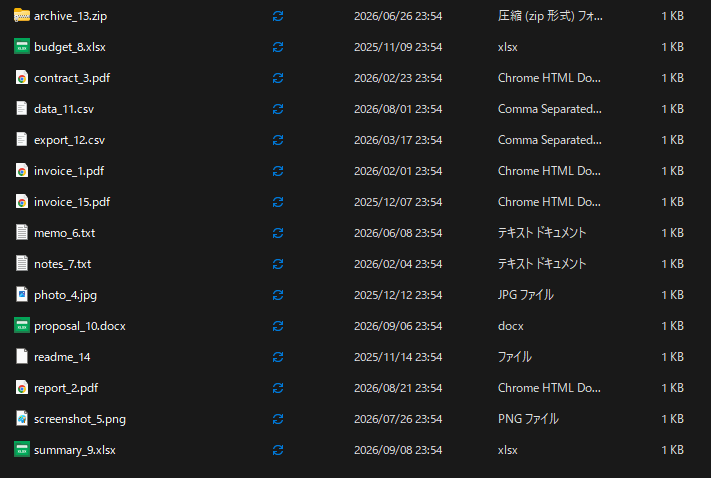
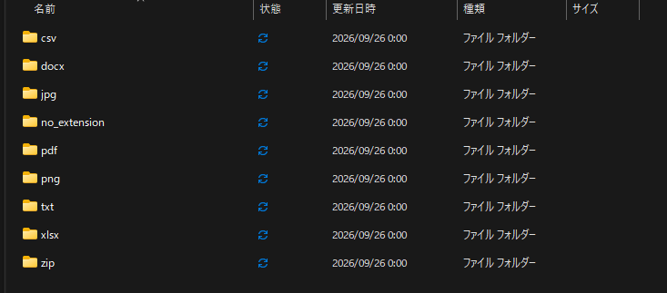
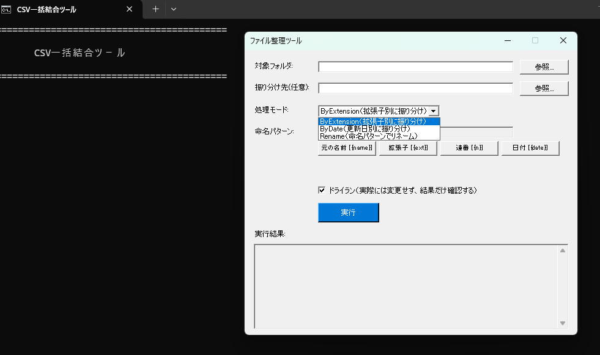
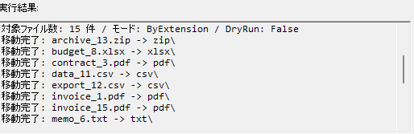

# Organize-Files.ps1 — 汎用ファイル振り分け・リネームツール

 

## 概要
指定フォルダ内のファイルを、用途に応じて自動で整理する PowerShell ツールです。
追加モジュール不要、PowerShell 標準コマンドレットのみで動作します。
コマンドが苦手な方向けに、ボタン操作だけで使える GUI 版も同梱しています。

| フォルダbefoer | After |
|---|---|
|  |  |


| GUI画面 | 実行結果サマリー |
|---|---|
|  |  |


### Before → After(ByExtensionモードの例)
```
[Before]                          [After]
C:\Downloads\                     C:\Downloads\
 ├─ report.pdf                     ├─ pdf\
 ├─ invoice.pdf                    │   ├─ report.pdf
 ├─ photo1.jpg                     │   └─ invoice.pdf
 ├─ photo2.jpg                     ├─ jpg\
 ├─ notes.txt                      │   ├─ photo1.jpg
 └─ data.xlsx                      │   └─ photo2.jpg
                                    ├─ txt\
                                    │   └─ notes.txt
                                    └─ xlsx\
                                        └─ data.xlsx
```

## できること
| モード | 内容 | 使用例 |
|---|---|---|
| `ByExtension` | 拡張子ごとにサブフォルダへ振り分け | ダウンロードフォルダの整理 |
| `ByDate` | 更新日(年-月)ごとにサブフォルダへ振り分け | 月次で溜まる資料の整理 |
| `Rename` | 指定パターンで連番リネームしながら移動 | 請求書PDFを部署別・日付付きで命名 |

## 特長
- **-DryRun オプション**:実際にファイルを動かす前に、変更内容だけをプレビュー可能(誤操作防止)
- **自動ログ出力**:処理結果をCSVに記録(いつ・何を・どこへ移動したか追跡できる)
- **エラーハンドリング**:1件失敗しても処理を止めず、失敗理由をログに記録して継続
- **GUI版**:命名パターンの記号をボタンで挿入でき、変換結果をリアルタイムプレビュー可能

## 使用例(コマンドラインで直接使う場合)

> 通常の納品では `start.bat` からGUIで操作すれば十分ですが、開発・デバッグ時や高度な操作をしたい場合はコマンドラインからも実行できます。

### 1. ダウンロードフォルダを拡張子別に整理(まずはプレビュー)
```powershell
.\Organize-Files.ps1 -SourceFolder "C:\Downloads" -Mode ByExtension -DryRun
```

### 2. 実際に振り分けを実行
```powershell
.\Organize-Files.ps1 -SourceFolder "C:\Downloads" -Mode ByExtension
```

### 3. 月ごとにフォルダ分け
```powershell
.\Organize-Files.ps1 -SourceFolder "C:\Reports" -Mode ByDate
```

### 4. 請求書PDFを「Invoice_日付_連番.pdf」形式でリネーム
```powershell
.\Organize-Files.ps1 -SourceFolder "C:\Invoices" -Mode Rename -RenamePattern "Invoice_{date}_{n}{ext}"
```

## 想定される業務シーン
- 経理担当者が毎月大量に受け取る請求書PDFを、部署別・日付順に自動整理
- 制作会社が納品物(画像・動画・PDF)を拡張子別に自動仕分け
- サーバーの出力ログや一時ファイルを月別アーカイブへ自動移動

## GUI版(Organize-Files-GUI.ps1)
コマンド操作に不慣れなクライアント向けに、フォーム画面で操作できる版を用意しています。
- フォルダ選択・モード切替・ドライラン確認がすべてボタン/チェックボックス操作で完結
- 命名パターンはボタンクリックで記号を挿入でき、変換結果をリアルタイムプレビュー
- 内部では `Organize-Files.ps1` を呼び出しているため、ロジックは共通(二重管理なし)

**起動方法**:同じフォルダに入っている `start.bat` を**ダブルクリック**するだけです。
コマンド入力や実行ポリシーの設定は不要です。

```
[配布フォルダの中身]
 ├─ start.bat              ← これをダブルクリック
 ├─ Organize-Files-GUI.ps1
 └─ Organize-Files.ps1
```

3ファイルはすべて同じフォルダに置いた状態で配布してください(GUIが `Organize-Files.ps1` を同一フォルダから呼び出すため)。

## 動作環境
- Windows PowerShell 5.1 以降 / PowerShell 7 以降
- 追加モジュール不要(標準コマンドレットのみで完結)

## 今後の拡張案
- 正規表現によるファイル名パターンマッチでの振り分け
- タスクスケジューラと連携した定期自動実行
- 処理前後のファイル数・容量サマリーをコンソールに表示

---
